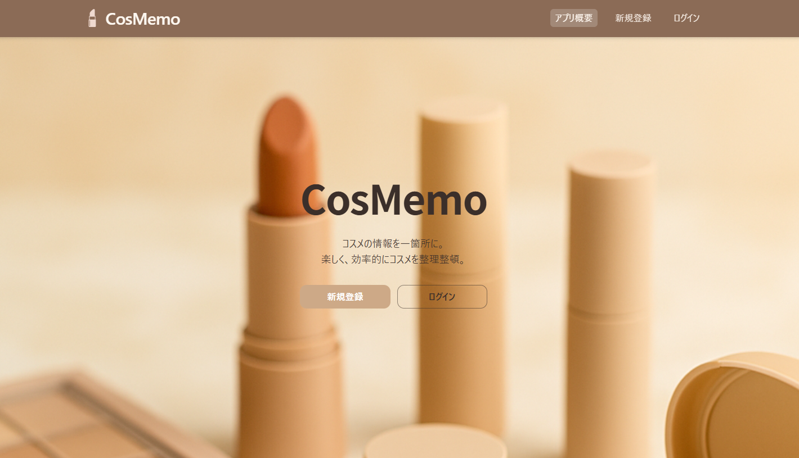
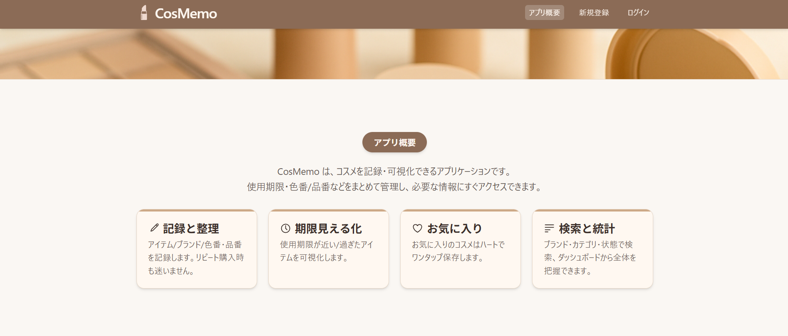
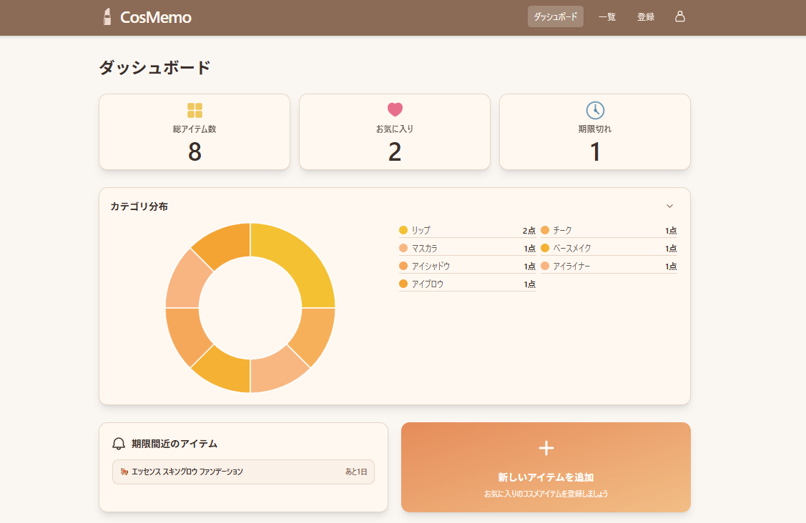
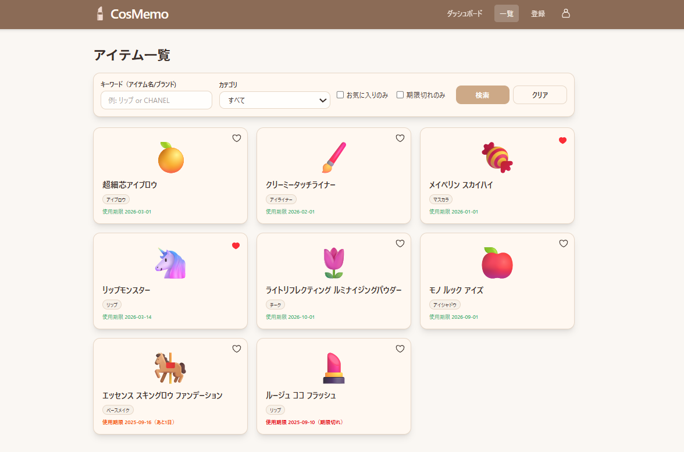
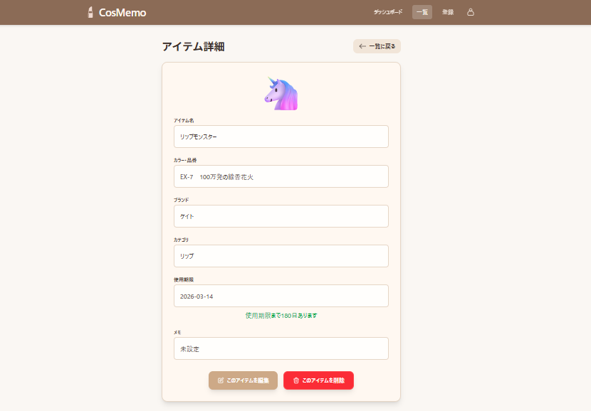
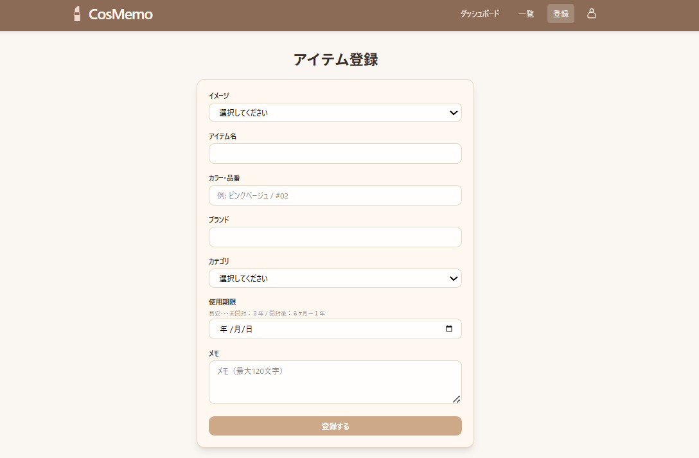
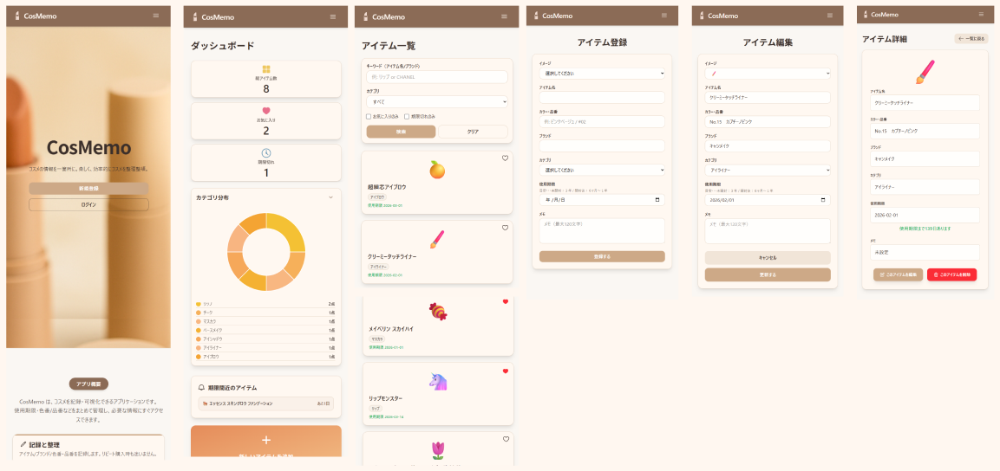
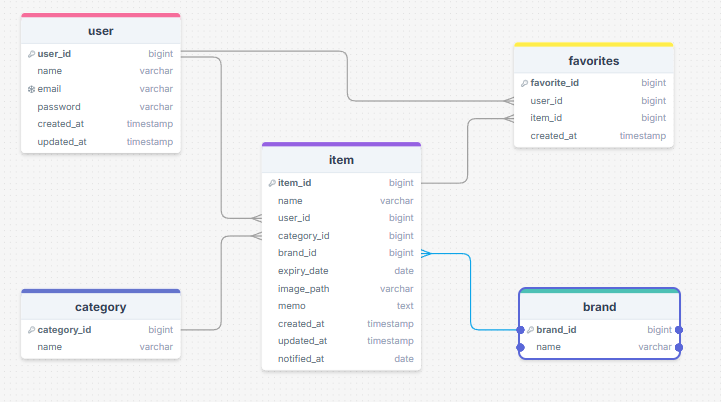

# CosMemo

**URL:** https://cosmemo.fly.dev/

**「コスメの整理整頓を楽しく、効率的に」**

ユーザーが所持するコスメの情報（カテゴリ・ブランド・使用期限など）を記録・可視化できる Web アプリケーションです。

**解決する課題:**

-   **「いつ開封したのか忘れた」** → 古いコスメを使い続けてしまう
-   **「こんな色持ってたかも」** → 似たような色のコスメを買ってしまう
-   **「いつも使ってる品番はなんだっけ」** → リピートして購入したいときに困る

このようなことを防ぎ、整理整頓をサポートします。

**MVP 版からの進化**: [初期 MVP](https://github.com/ysmk620/mvp-app)で検証した基本機能をベースに、ユーザビリティとデザインを向上させたポートフォリオ版です。

## スクリーンショット

### トップページ

### アプリ概要

### メイン画面(ダッシュボード)

### アイテム一覧画面

### アイテム詳細画面

### アイテム登録画面

### レスポンシブデザイン

## 主要機能

- **ユーザー認証**：メール認証対応
- **コスメCRUD**：登録・閲覧・編集・削除の管理機能
- **ダッシュボード**：統計情報・期限リマインド表示
- **期限切れリマインド**：使用期限が近いアイテムをお知らせ
- **お気に入り機能**：よく使うコスメをワンタッチでお気に入り登録
- **検索・フィルタ**：商品名・ブランド・カテゴリ・お気に入り・期限切れで絞り込み

## 使用技術

**バックエンド**

- Laravel 12
- PHP 8.2+

**フロントエンド**

- Blade + Vite
- Tailwind CSS 4

**データベース**

- PostgreSQL

**開発環境**

- Docker + Laravel Sail
- Composer
- npm

## データベース設計

### ER 図

## はじめかた

-   https://cosmemo.fly.dev/ にアクセス
-   「新規登録」からアカウントを作成
-   届いたメールの「メールアドレス確認」をクリック
-   ログインして利用開始

メールが届かない場合は迷惑メールフォルダをご確認ください。

