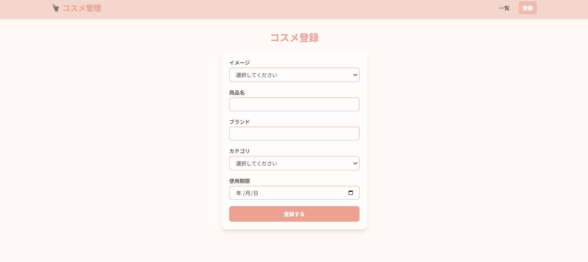
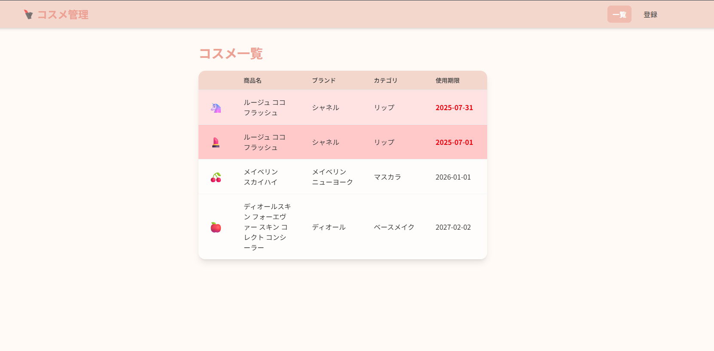

# アプリ名（未定）


[URL(デプロイ後)](#)

## 目次

- [サービス概要](#サービス概要)
- [スクリーンショット](#スクリーンショット)
- [主要機能](#主要機能)
- [使用技術](#使用技術)
- [データベース設計](#データベース設計)
- [セットアップ](#セットアップ)
---

## サービス概要

**「コスメの整理整頓を楽しく、効率的に」**

ユーザーが所持するコスメの情報（カテゴリ・ブランド・使用期限など）を記録・可視化できる Web アプリケーションです。

**解決する課題:**

-   **「いつ開封したのか忘れた」** → 古いコスメを使い続けてしまう
-   **「こんな色持ってたかも」** → 似たような色のコスメを買ってしまう
-   **「いつも使ってる品番はなんだっけ」** → リピートして購入したいときに困る

このようなことを防ぎ、整理整頓をサポートします。

**MVP 版からの進化**: [初期 MVP](https://github.com/ysmk620/mvp-app)で検証した基本機能をベースに、ユーザビリティとデザインを向上させたポートフォリオ版です。

## スクリーンショット

### メイン画面(ダッシュボード)

_実装完了後に追加予定_

### コスメ登録画面

_MVP版(実装完了後に差し替え予定)_



### コスメ一覧画面

_MVP版(実装完了後に差し替え予定)_




## 主要機能
-   **コスメCRUD**: 登録・閲覧・編集・削除の完全な管理機能
-   **期限切れハイライト**: 使用期限が近い・過ぎたアイテムの視覚的警告
-   **お気に入り機能**: よく使うコスメのブックマーク・専用表示
-   **ダッシュボード**: 統計情報・期限アラート・使用状況の一覧表示
-   **検索・フィルタ**: 商品名・ブランド・カテゴリによる効率的な絞り込み
-   **ユーザー認証**: 個人データ保護とマルチユーザー対応

## 使用技術

### バックエンド

-   **Laravel 12**
-   **PHP 8.2+**
-   **PostgreSQL**

### フロントエンド

-   **Blade + Vite**
-   **Tailwind CSS 4**

### 開発環境

-   **Docker + Laravel Sail**
-   **Composer**
-   **npm**

## データベース設計

### ER図


## セットアップ

### 必要な環境
- Docker Desktop
- PHP 8.2+ (ローカル開発の場合)
- Composer
- Node.js & npm

### インストール手順

1. **リポジトリのクローン**
```bash
git clone [repository-url]
cd mvp-app
```

2. **依存関係のインストール**
```bash
composer install
npm install
```

3. **環境設定**
```bash
cp .env.example .env
php artisan key:generate
```

4. **データベースの初期化**
```bash
php artisan migrate
php artisan db:seed
```

5. **開発サーバーの起動**
```bash
composer run dev
```

または個別に実行:
```bash
php artisan serve
npm run dev
```

## 使用方法

1. ブラウザで `http://localhost:8000` にアクセス
2. 「登録」から商品情報を登録
3. 「一覧」で登録したコスメを確認


