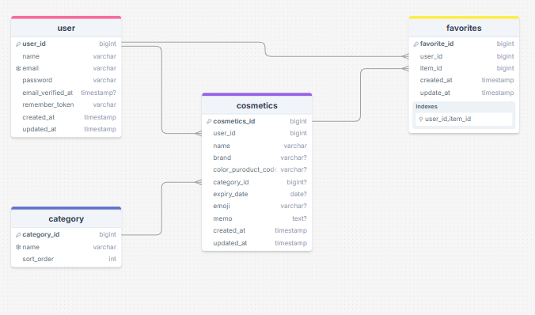

# CosMemo


[URL(デプロイ後)](#)

## 目次

- [サービス概要](#サービス概要)
- [スクリーンショット](#スクリーンショット)
- [主要機能](#主要機能)
- [使用技術](#使用技術)
- [データベース設計](#データベース設計)
- [セットアップ](#セットアップ)
---

## サービス概要

**「コスメの整理整頓を楽しく、効率的に」**

ユーザーが所持するコスメの情報（カテゴリ・ブランド・使用期限など）を記録・可視化できる Web アプリケーションです。

**解決する課題:**

-   **「いつ開封したのか忘れた」** → 古いコスメを使い続けてしまう
-   **「こんな色持ってたかも」** → 似たような色のコスメを買ってしまう
-   **「いつも使ってる品番はなんだっけ」** → リピートして購入したいときに困る

このようなことを防ぎ、整理整頓をサポートします。

**MVP 版からの進化**: [初期 MVP](https://github.com/ysmk620/mvp-app)で検証した基本機能をベースに、ユーザビリティとデザインを向上させたポートフォリオ版です。

## スクリーンショット

### トップページ


### アプリ概要


### メイン画面(ダッシュボード)


### アイテム一覧画面


### アイテム詳細画面


### アイテム登録画面


### レスポンシブデザイン


## 主要機能
-   **ユーザー認証**: メール認証対応
-   **コスメCRUD**: 登録・閲覧・編集・削除の管理機能
-   **ダッシュボード**: 統計情報・期限リマインド表示
-   **期限切れリマインド**: 使用期限が近いアイテムをお知らせ
-   **お気に入り機能**: よく使うコスメをワンタッチでお気に入り登録
-   **検索・フィルタ**: 商品名・ブランド・カテゴリ・お気に入り・期限切れで絞り込み


## 使用技術

### バックエンド

-   **Laravel 12**
-   **PHP 8.2+**
-   **PostgreSQL**

### フロントエンド

-   **Blade + Vite**
-   **Tailwind CSS 4**

### 開発環境

-   **Docker + Laravel Sail**
-   **Composer**
-   **npm**

## データベース設計

### ER図



## セットアップ手順

### 必要環境
- Docker および Docker Compose
- （Windows）WSL2 + Ubuntu 推奨
- PHP 8.2以上（ローカル実行時）
- Composer（ローカル実行時）

### インストール方法

#### 1. リポジトリのクローンと移動
```bash
git clone https://github.com/ysmk620/cosmetics-manager
cd cosmetics-manager
```
#### 2. 環境設定
```bash
cp .env.example .env
```
#### 3. Composer 依存関係をインストール
```bash
./vendor/bin/sail composer install
```
#### 4. Docker環境の起動
```bash
./vendor/bin/sail up -d
```
#### 5. アプリ初期化
```bash
./vendor/bin/sail artisan key:generate
./vendor/bin/sail artisan storage:link
```
#### 6. データベース準備
```bash
./vendor/bin/sail artisan migrate
./vendor/bin/sail artisan db:seed --class=CategorySeeder
#カテゴリ選択にはカテゴリデータが必要です。上記の CategorySeeder 実行でプルダウンが表示されます。
```
#### 7. フロントエンド依存関係
```bash
./vendor/bin/sail npm install
./vendor/bin/sail npm run dev
```
## 使用方法

- ブラウザで [http://localhost] にアクセス（Sail 利用時）。
- 新規ユーザー登録後、Mailpit [http://localhost:8025] に届いた認証メールのリンクをクリックしてメール認証を完了してください。
- 認証後、アイテム登録・一覧・編集などの機能を利用できます。
