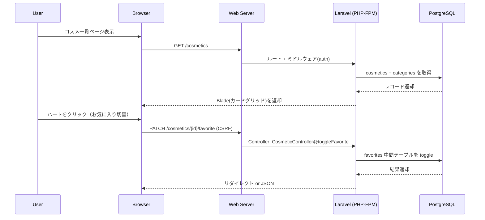
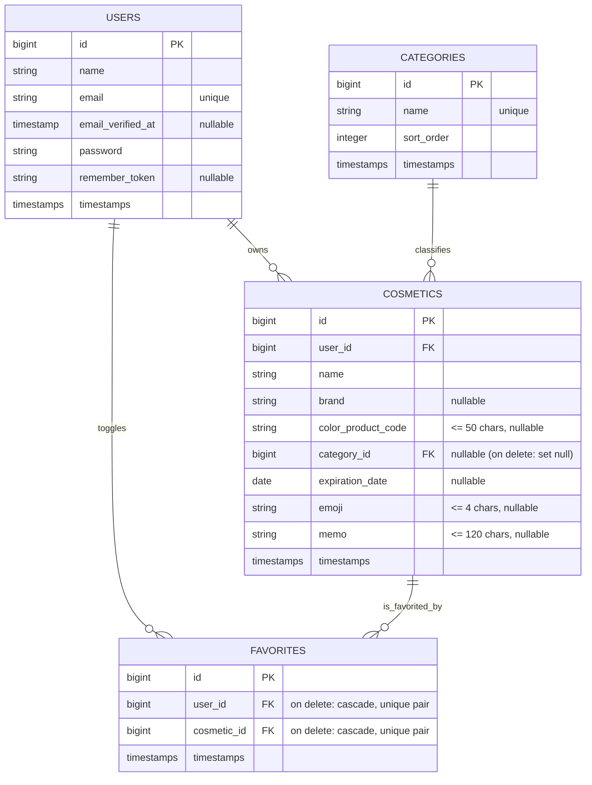

# アーキテクチャ概要

このリポジトリは Laravel ベースのサーバーサイドレンダリング(SSR)アプリです。フロントエンドは Blade + Tailwind CSS + Alpine.js を中心に構成し、資産ビルドとHMRに Vite を利用します。データベースは PostgreSQL を使用します。

## 全体像

```mermaid
flowchart LR
    subgraph Browser[Browser]
        UI[Blade Views + Tailwind + Alpine]
    end

    subgraph Dev[Vite Dev (開発時)]
        Vite[Vite Dev Server :5173]
    end

    subgraph Web[Laravel Sail コンテナ]
        WS[Web Server (Caddy/Nginx)]
        PHP[PHP-FPM + Laravel]
    end

    subgraph DB[(PostgreSQL)]
        PG[(postgres:17)]
    end

    UI -- HTML/JS/CSS --> WS
    WS --> PHP
    PHP <--> PG

    %% 開発時はアセットを Vite Dev Server から取得（HMR）
    UI -. HMR Assets .-> Vite

    %% 本番時はビルド済みアセットを Web サーバから配信
```

- フロントエンド: Blade テンプレートで SSR。スタイルは Tailwind CSS、動的な振る舞いは Alpine.js。
- ビルド/開発: `laravel-vite-plugin` 経由で Vite を使用（開発時は :5173 の HMR、運用はビルド済み静的資産）。
- バックエンド: Laravel (Controllers, Models, Middleware, Validation)。
- データベース: PostgreSQL 17。ユーザ・コスメ・カテゴリ・お気に入り(中間)を保持。
- プロキシ/サーバ: Laravel Sail の Web サーバ(Caddy/Nginx)が HTTP を受け付け、PHP-FPM に連携。外部専用のリバースプロキシ設定は本リポジトリには含まれていません。

開発用ポート (docker-compose.yml より):
- HTTP: `${APP_PORT:-80}` → コンテナの 80
- Vite HMR: `${VITE_PORT:-5173}` → コンテナの 5173
- PostgreSQL: `${FORWARD_DB_PORT:-5432}` → コンテナの 5432

## リクエストフロー（例: 一覧〜お気に入り切替）



## ドメインモデル（ER）



補足:
- 一覧はテーブルからカードグリッド（1列:モバイル / 2列:sm / 3列:lg）へ刷新済み。
- フィルタ（キーワード・カテゴリ・お気に入り）やページネーションは Laravel 側で処理し、クエリストリングを保持。
- お気に入り切替は `PATCH /cosmetics/{id}/favorite` のサーバ処理で実行（Ajax化も可能）。
- `CATEGORIES.name` は一意制約（UNIQUE）を持つ。
- `FAVORITES` はサロゲートキー `id` を持ち、`UNIQUE(user_id, cosmetic_id)` を付与。`users`/`cosmetics` の削除時はカスケードで関連行が削除される。

## 開発とビルド

- 開発: `npm run dev` で Vite Dev Server が起動し、Blade から HMR を利用。
- 本番: `npm run build` でビルドした静的資産を Web サーバから配信。
- Sail: `docker-compose.yml` にて `laravel.test` (Web/PHP) と `pgsql` を起動します。

## 設定の要点

- DB: `.env` で `DB_CONNECTION=pgsql` を指定。PHP に `pdo_pgsql` 拡張が必要。
- ルーティング: `routes/web.php` に `auth` ミドルウェア配下で `cosmetics.*` ルートを定義。
- コントローラ: `App\Http\Controllers\CosmeticController` が CRUD とお気に入り切替を担当。
